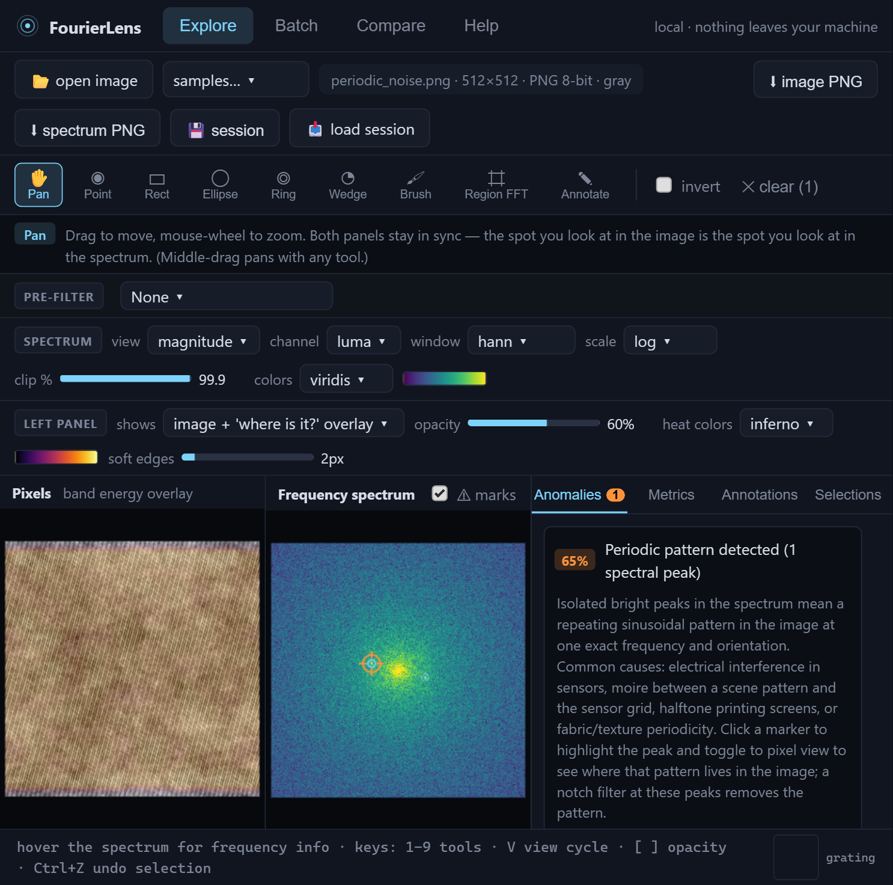

# FourierLens

[](https://github.com/NabilAldhamari/fourierlens/actions/workflows/ci.yml)
[](LICENSE)
[](https://www.python.org/downloads/)
[](https://numpy.org/)
[](https://react.dev/)
[](#privacy)

**Interactive Fourier analysis for computer vision research.** Explore any image in the frequency domain, see exactly *where* each frequency lives in pixel space, annotate and share findings, flag spectral anomalies automatically, and batch-audit entire datasets with exportable metrics.

Everything runs **locally**; no image ever leaves your machine.



## Quickstart

With [uv](https://docs.astral.sh/uv/) (recommended, installs nothing globally):

```bash
git clone https://github.com/NabilAldhamari/fourierlens
cd fourierlens
uv run fourierlens
```

Or install the released package (once published to PyPI):

```bash
pipx install fourierlens   # or: uvx fourierlens
fourierlens
```

Or with plain Python (3.10+):

```bash
pip install -e .
fourierlens
```

Or just double-click `start.bat` (Windows) / run `./start.sh` (macOS/Linux).

Your browser opens at `http://127.0.0.1:8321` with a sample gallery ready to explore. No configuration, no accounts, no GPU required.

## Run with Docker

The container needs no Python or Node on your machine, only Docker.

With Docker Compose (easiest):

```bash
docker compose up
```

Then open `http://127.0.0.1:8321` in your browser. Stop it with `Ctrl+C`, or run detached with `docker compose up -d` and stop with `docker compose down`.

To analyze your own dataset in batch mode, drop it into a `./data` folder next to `docker-compose.yml` (it is mounted read-only at `/data` inside the container) and point the batch folder field at `/data`.

Prebuilt image from GitHub Container Registry:

```bash
docker run --rm -p 127.0.0.1:8321:8321 ghcr.io/nabilaldhamari/fourierlens:latest
```

Always publish the port on `127.0.0.1` as shown: the app can browse and read files on the machine it runs on, so it must not be reachable from your network.

Plain Docker, without Compose:

```bash
docker build -t fourierlens .
docker run --rm -p 127.0.0.1:8321:8321 fourierlens
```

## What it does

### Single-image explorer
- **Synced dual panels:** the pixel view and the frequency spectrum zoom and pan together, so the spot you inspect in the image is the spot you inspect in the spectrum.
- Magnitude / phase / power spectra with DC centered, log/linear/gamma scaling, percentile clipping, colormaps, and window functions (Hann, Hamming, Blackman, Tukey) with plain-language explanations.
- **Optional pre-filtering** before analysis (grayscale/luma, histogram equalize, sharpen, blur, Sobel edges, Laplacian, median denoise, invert), because edge extraction or equalization often makes subtle spectral structure far easier to see.
- **Frequency to pixel:** select any spectrum region (point + conjugate, rectangle, ellipse, ring, orientation wedge, freehand brush) and see the band's energy overlaid on the image with adjustable opacity, showing exactly where that frequency content lives.
- **Pixel to frequency:** drag any shape on the image to see that region's localized spectrum.
- Filtering playground: low/high/band-pass, notch, directional and hand-drawn masks with live inverse-FFT reconstruction and a before/after divider.
- Hover readout: cycles/px, wavelength, orientation, plus a live preview of the sinusoidal grating each spectrum point represents.
- Progressive reconstruction: rebuild the image frequency-by-frequency.
- A persistent hint bar and rich tooltips explain what every tool and option does.

### Annotations & sessions
- Pin multiple named, colored highlights with comments to spectrum regions, image regions, or single pixels.
- Save/load sessions as JSON; export annotated views as PNG.

### Anomaly flagging
Automatic detectors with human-readable explanations:
- Isolated spectral peaks: periodic noise, moire, sensor interference.
- Energy at multiples of 1/8 sampling rate: JPEG block-compression fingerprint.
- Spectral slope deviations from the natural-image 1/f^2 law: over-sharpening, synthetic (GAN/diffusion) content, or upscaling/blur.

### Batch mode
- Analyze whole folders in parallel; per-image records include resolution, aspect ratio, hashes, and a configurable set of spectral metrics (radial power profile, spectral slope alpha, high-frequency energy ratio, entropy, orientation statistics, blur score, anomaly flags, and more).
- Dataset-level mean spectrum and per-image spectral outlier ranking.
- Export CSV / JSON / Parquet. Headless CLI for pipelines:

```bash
fourierlens batch ./my_dataset --recursive --export report.parquet
fourierlens analyze photo.png --json
```

### Compare mode
Load two images side by side and view the difference of their spectra, the classic way to spot how a generated or processed image departs from a real one.

## Supported formats

PNG, JPEG, WebP, BMP, GIF, and 8/16/32-bit TIFF (grayscale or RGB).

## Privacy

FourierLens runs entirely on your machine. Images, spectra, and reports never leave `127.0.0.1`, which keeps medical, proprietary, or unpublished research data safe.

## Development

Backend: Python (NumPy/SciPy/FastAPI) in `src/fourierlens`; tests with `pytest`.
Frontend: React + TypeScript + Vite in `frontend/`; the production build is committed to `src/fourierlens/webui` so end users never need Node.

```bash
pip install -e ".[dev]"
pytest

# Live-reload dev loop: API on :8321 (auto-reloads on Python edits),
# UI on :5173 (Vite HMR, proxies /api to :8321)
fourierlens serve --dev --no-browser
cd frontend && npm install && npm run dev

# Refresh the committed production bundle after UI changes
npm run build
```

Lint with `ruff check src tests`. CI runs ruff, the pytest matrix (Linux, Windows, macOS; Python 3.10, 3.12, 3.13), a wheel install smoke test, a Docker build, and verifies the committed `webui` bundle is up to date with the frontend sources.

### Releasing

1. Bump `__version__` in `src/fourierlens/__init__.py` (and `version` in `frontend/package.json`), and move the changelog entries under the new version.
2. Merge to `main`, then push a tag: `git tag v0.2.0 && git push origin v0.2.0`.
3. The Release workflow tests, builds, smoke-tests the wheel, creates the GitHub Release and pushes the Docker image to GHCR. To also publish to PyPI, add a trusted publisher for this repository (workflow `release.yml`, environment `pypi`) and set the repository variable `PUBLISH_TO_PYPI` to `true`.

## License

MIT
